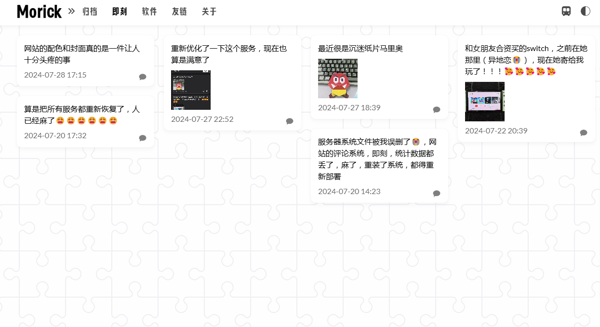

# Pieces

> 使用Python + Flsak搭建的使用Docker部署的一个类[memos](https://www.usememos.com/)的小项目。用于随时随地记录想法，并同步展现在博客页面。

> ⚠警告
> 
> 本项目主要为自用，并无能力和经历进行维护，安全性、性能、稳定性等无法保证。

## 预览

### 记录页面


### 博客展示



## 修改与部署

1. 首先 clone 本项目到本地;
2. 构建虚拟环境，安装flask;
3. 运行`pieces.py`文件，本地修改调试;
4. 调试完成后，命令行运行`docker build -t pieces .`构建pieces镜像；
5. 运行`docker save -o pieces.tar pieces`导出镜像`tar`文件；
6. 镜像`tar`文件上传到云服务器合适的位置；
7. 运行`docker load -i pieces.tar`导入镜像。
8. 执行下述命令，运行容器。

```bash
docker run -d \
    -p 10055:10055 \  # 端口映射
    -v /home/Pieces/data:/data \  # 挂载本地目录到容器目录
    -e USERNAME=admin \  # 用户名
    -e PASSWORD=pieces \    # 密码
    --name pieces \
    pieces
```

然后进行子域名分配和解析、反向代理。

## 数据获取

直接访问`你的域名/data.json`获取数据，使用js加载到博客的静态页面。

## 使用到的项目

- [Lightbox2](https://github.com/lokesh/lightbox2)